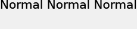

# 文字定位{#text-positioning}

當套用至預先設定大小的圖層時（亦即指定size=時），`text=`轉譯器會定位與textPs=轉譯器截然不同的文字。

自行調整大小的`text=`和`textPs=`圖層具有相似的外觀和位置。

`textPs=`會將字元儲存格的頂端與文字方塊的頂端對齊（假設為`\vertalt`），即使它會導致部分轉譯的文字字元延伸到文字方塊邊界之外。 某些字型的演算影象也可能稍微超出文字方塊的左右邊緣。 對於要求所有已轉譯文字都包含在圖層矩形內的應用程式，可以使用RTF `\marg*`命令或`textFlowPath=`來調整文字轉譯區域。

相對地，`text=`會視需要移動轉譯的文字，並確保所有轉譯的字元完全符合指定的文字方塊。

雖然`text=`在簡單應用程式中可能更容易使用，但`textPs=`提供精確定位，不受字型表面和文字效果影響。

## 範例 {#section-1b6bdf2ea34447528188ae4e1430ee71}

以下範例適用於預先調整大小的文字。 自動調整文字大小的行為不同。

**&#x200B; `Text=`一律會在頂端提供窄邊界：**

`/is/image/?size=230,50&bgc=f0f0f0&fmt=png&text=\fs40Normal%20Normal%20Normal`

**案`textPs=`會將文字緊密對齊文字方塊頂端，即使是Arial®：**&#x200B;等常見字型也會造成輕微的剪裁

`/is/image/?size=230,50&bgc=f0f0f0&fmt=png&textPs=\fs40Normal%20Normal%20Normal`

**&#x200B; `text=`會自動將演算後的文字下移以避免剪裁：**

`/is/image?size=230,50&bgc=f0f0f0&fmt=png&text=\fs40Normal%20{\up20Raised%20}Normal`

**&#x200B; `textPs=`不會移動包含凸出部分的文字，如果文字在圖層0：**&#x200B;上，則會造成明顯的剪裁

`/is/image?size=230,50&bgc=f0f0f0&fmt=png&textPs=\fs40Normal%20{\up20Raised%20}Normal`

在上方的&#x200B;**10點（200倍）邊界轉譯此文字而不剪裁：**

`/is/image?size=230,50&bgc=f0f0f0&fmt=png&textPs=\margt200\fs40Normal%20{\up20Raised}%20Normal`

**某些指令碼字型的演算字元可能會顯著延伸至文字方塊之外：**

`/is/image?size=230,50&bgc=f0f0f0&fmt=png&textPs={\fonttbl{\f1\fcharset0%20FluffyFont;}}\f1\fs88%20fluffy%20font%20problems`
